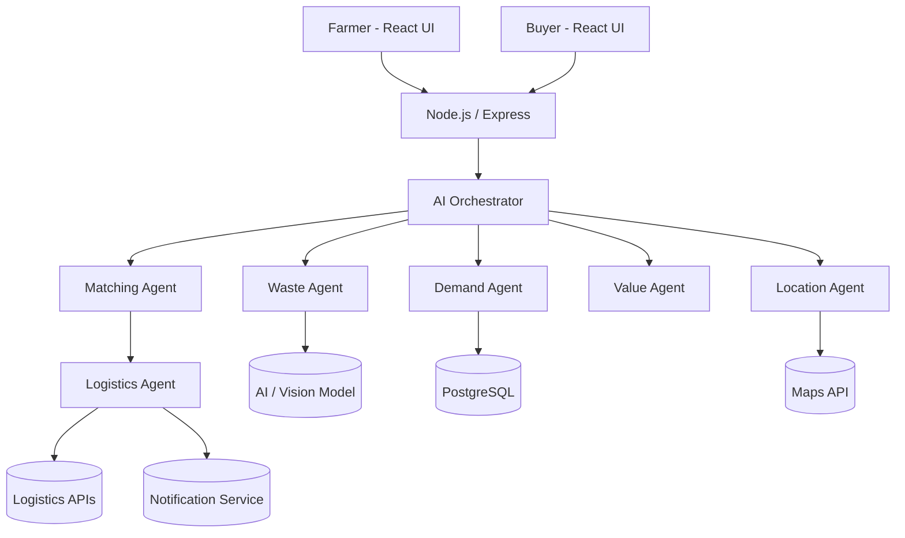

# Architecture

## Agent contract
Every agent is `async (ctx) => { ctx.trace.push(...); return partialContext }`.
The orchestrator owns the plan, calls agents in order, stops early if a step yields nothing (e.g. no demand found), and returns `{ waste, demand, matches, pathway, trace }`.

## Data model
See `backend/src/db/schema.sql`: `users`, `waste_listings`, `buyer_requirements`, `matches`, `pickup_requests`.

## Swapping in real services
- `classifyWaste()` → call a vision/LLM model (see TODO in `tools.js`)
- `calculateDistance()` → Google Maps Distance Matrix / OSRM
- `searchBuyerRequirements()` → PostgreSQL query (schema provided)
- `createPickupRequest()` → logistics partner API + notification service
